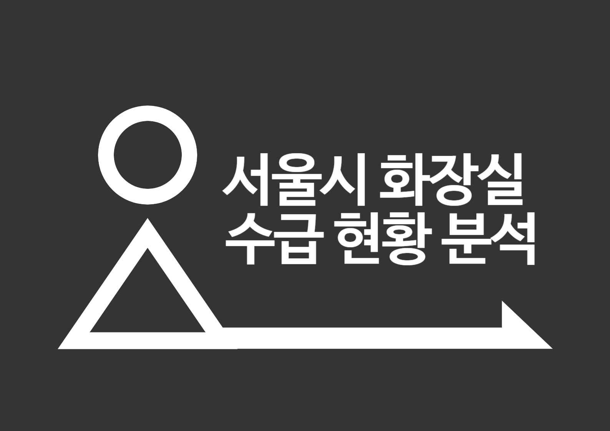

# 🚀 Portfolio Showcase

  

 

## ✨ Featured Project

  
  
    
  
  <h3>🎯 Project Name Here</h3>
  

    
    
    
  

  
<i>프로젝트에 대한 간단한 설명을 여기에 작성하세요</i>

  

## 🎨 More Amazing Works

  <table>
    <tr>
      <td width="50%" align="center">
        
        <h3>🔍 AI 기반 네이버 블로그 분석 시스템</h3>
        
협찬 글 범람 시대, 객관적 정보만 추출하는 스마트 솔루션

        

          
          
          
          
          
        

        

          <strong>🎯 핵심 성과:</strong> 
          • 분석 시간 92% 단축 (25분 → 2분) 
          • 최대 100개 블로그 동시 분석 자동화 
          • AI 기반 광고성 콘텐츠 85% 정확도 필터링 
          • 6가지 관점별 맞춤 분석 (가격/성능/디자인 등) 
          • 경쟁 제품 실시간 비교 분석 기능
        

        

          
          
        

      </td>
      <td width="50%" align="center">
        
        <h3>🚻 서울시 화장실 수급 현황 분석</h3>
        
데이터로 풀어보는 도시 인프라 불평등 문제

        

          
          
          
          
        

        

          <strong>🎯 핵심 성과:</strong> 
          • 여성 화장실 구조적 불평등 통계적 입증 (p < 0.001) 
          • 423개 행정동 화장실 수급 현황 정량화 
          • 시간대별 화장실 대란 패턴 발굴 
          • 지역별 우선순위 기반 정책 제안서 도출
        

        

          
          
        

      </td>
    </tr>
  </table>

  

  <h3>📫 Connect with Me</h3>
  

    
    
  

 

  

