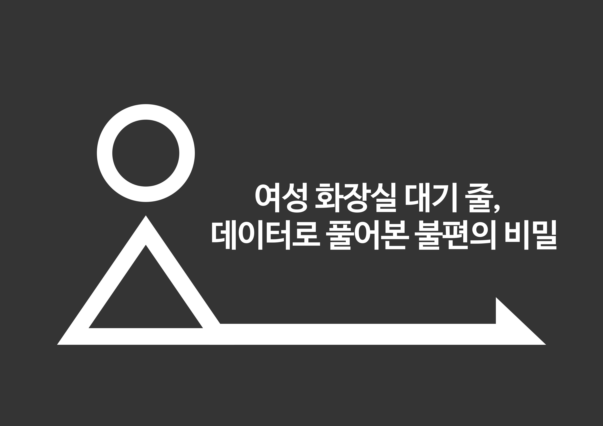

  

**총 3개 프로젝트** (메인 1개 + 서브 2개)로 구성되어 있습니다.  
기획부터 배포까지 전체 개발 사이클을 완주한 결과물입니다.

### 프로젝트 구성
- **LIVE DEMO**: 실제 배포된 서비스
- **PPT/REPORT**: 기술 아키텍처 및 구현 과정 상세 분석

> **탐색 방법**: Live Demo 확인 → 기술 문서 검토

---

## ✨ Main Project

  
  
    
  
  <h3>🎯 Risk Killer</h3>
  
FDA 데이터 기반, 미국 식품 시장 규제 준수 및 위험 관리 통합 솔루션

   
  

    
    
    
    
    
  

  

    <strong>🎯 핵심 성과:</strong> 
    • FDA 데이터 크롤링 및 정제 
    • 고급 RAG 챗봇 구현 
    • Tableau 기반 시장 동향 시각화 
    • AI 요약 및 데이터 추출 
    • 올인원 솔루션 제공
  

  

  
  

  

## 🎨 Sub Project

  <table>
    <tr>
      <td width="50%" align="center">
        
        <h3>🔍 AI 기반 네이버 블로그 분석 시스템</h3>
        
협찬 글 범람 시대, 객관적 정보만 추출하는 스마트 솔루션

         
        

          
          
          
          
          
        

        

          <strong>🎯 핵심 성과:</strong> 
          • 분석 시간 단축  
          • 최대 100개 블로그 동시 분석 자동화 
          • AI 기반 광고성 콘텐츠 필터링 
          • 6가지 관점별 맞춤 분석 (가격/성능/디자인 등) 
          • 경쟁 제품 실시간 비교 분석 기능
        

        

          
          
        

      </td>
      <td width="50%" align="center">
        
        <h3>🚻 서울시 화장실 수급 현황 분석</h3>
        
데이터로 풀어보는 도시 인프라 불평등 문제

         
        

          
          
          
          
          
        

        

          <strong>🎯 핵심 성과:</strong> 
          • 여성 화장실 수급 부족 현상 통계적 검증 
          • 화장실 수급 현황 정량화 
          • 시간대별 화장실 대란 패턴 발굴 
          • 지역별 우선순위 기반 정책 제안 도출 
          • 수요 기반 수급 불균형 진단 로직 구축
        

        

          
          
        

      </td>
    </tr>
  </table>

  

  <h3>📫 Connect with Me</h3>
  

    
    
  

 

  

